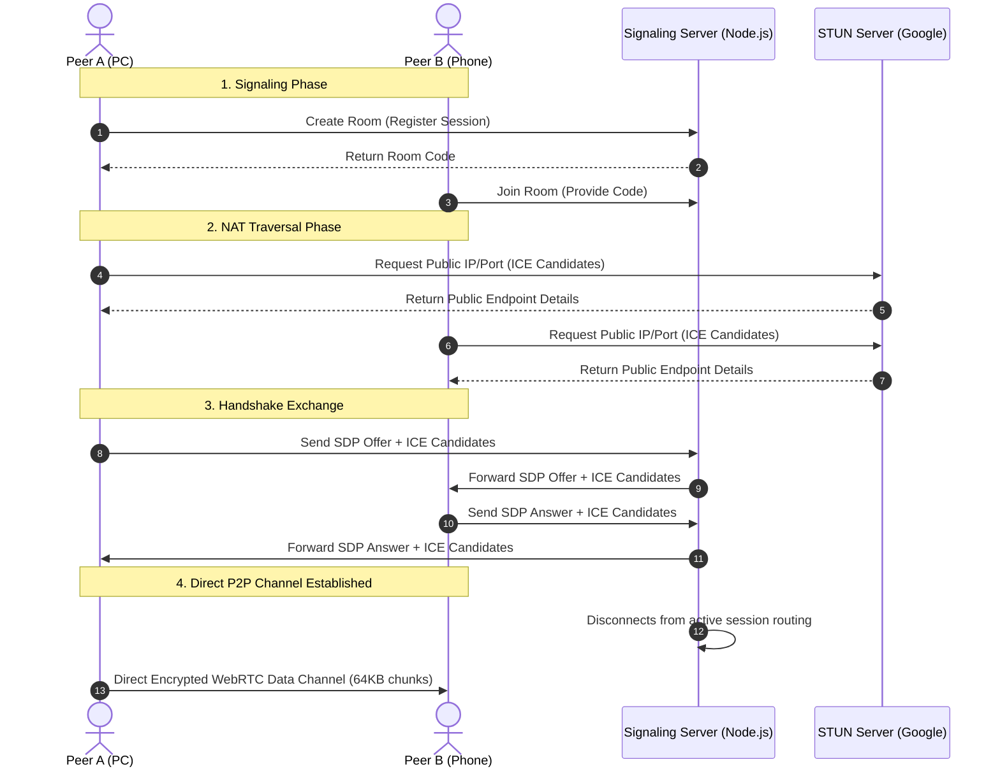

# 🔗 PeerDrop — P2P File, Text & Screen Sharing

Share files, text snippets, and your screen **directly** between browsers.  
No cloud storage. No data passes through any server once peers are connected.

---

## How it works

PeerDrop uses WebRTC to establish a direct, peer-to-peer data channel. A signaling server is temporarily used to negotiate the connection.



The signaling server only helps peers *find each other* via a room code.
After that, all file, text, and screen data flows **directly** between browsers.

---

## Quick Start

### 1. Install dependencies
```bash
npm install
```

### 2. Start the signaling server
```bash
npm start
# or for development with auto-restart:
npm run dev
```

The server runs on `ws://localhost:3000` by default.

### 3. Open the app
Open `index.html` in your browser. Both peers need access to it.

> **For local testing:** Open two browser tabs or windows on the same machine.  
> **For LAN sharing:** Host `index.html` on any static file server, e.g.:
> ```bash
> npx serve .
> ```
> Then both peers open the same IP address.

---

## Usage

1. **Peer A** clicks **Create room** → gets a code like `FIRE-1234`
2. **Peer B** clicks **Join room** → enters the code
3. WebRTC handshake happens automatically — you'll see "P2P CONNECTED"
4. Now share:
   - **Files tab**: drag & drop or browse files (any size)
   - **Text tab**: paste text, code, links, etc.
   - **Screen tab**: share your display live

---

## Flow Control Mechanism

To prevent flooding the browser's memory buffer during large file transfers, PeerDrop implements backpressure tracking:
- **Buffer Threshold**: Monitors `RTCDataChannel.bufferedAmount`.
- **Throttling**: If the buffer exceeds 16 MB (`16777216` bytes), the reader pauses chunking.
- **Resumption**: Listens for the `bufferedamountlow` event to resume streaming the next array buffer chunks safely.

---

## 🔒 Security & Context Requirements

- **Localhost Development**: WebRTC and Web Crypto APIs operate without restrictions on `http://localhost`.
- **LAN / Network Testing**: Accessing the app via a local IP (e.g., `http://192.168.1.X`) allows Data Channels to connect, but modern browsers will block access to `getDisplayMedia` (Screen Sharing) unless a secure HTTPS origin context is provided.
- **Production Deployment**: Must be hosted behind a secure `https://` origin (with a corresponding `wss://` signaling endpoint) for all sharing protocols to function properly on mobile devices.

---

## Deploying to production

### Signaling server
Deploy `server.js` to any Node.js host (Railway, Fly.io, Render, etc.):

```bash
# Example with Railway
railway up
```

### Frontend
In `index.html`, update the `WS_URL` line:

```js
const WS_URL = `wss://your-server.example.com`;  // use wss:// for HTTPS
```

Then host `index.html` on any static host (Netlify, Vercel, GitHub Pages, Cloudflare Pages).

---

## Architecture Roadmap & Improvements

To achieve seamless connectivity across all network configurations (including mobile data and strict NATs), the following improvements are prioritized:

1. **TURN Server Integration**: Deploying a TURN server (e.g., `coturn`) is the single biggest improvement for real-world reliability, allowing connections when direct P2P fails (e.g., across CGNAT).
2. **Local Signaling Fallback**: Allowing the application to fall back to a local WebSocket server so it works on LAN even without an internet connection.
3. **Relay Fallback**: Implementing a temporary relay storage mechanism if ICE state fails completely.
4. **Device Discovery**: Adding mDNS or broadcast beacons for auto-discovery on LAN instead of relying solely on manual room codes.

---

## Tech stack

| Piece | Technology |
|---|---|
| Signaling | Node.js + `ws` (WebSockets) |
| P2P transport | WebRTC (RTCPeerConnection) |
| File transfer | WebRTC Data Channels (binary) |
| Screen sharing | `getDisplayMedia` + RTCPeerConnection tracks |
| UI | Vanilla HTML/CSS/JS (no framework) |

---

## Notes
- **Max 2 peers per room** (full mesh; expand for groups)
- File transfers use 64 KB chunks with flow control
- STUN servers from Google are used for NAT traversal (free, no signup)
- For users behind strict corporate firewalls, configure custom TURN credentials in the settings.
